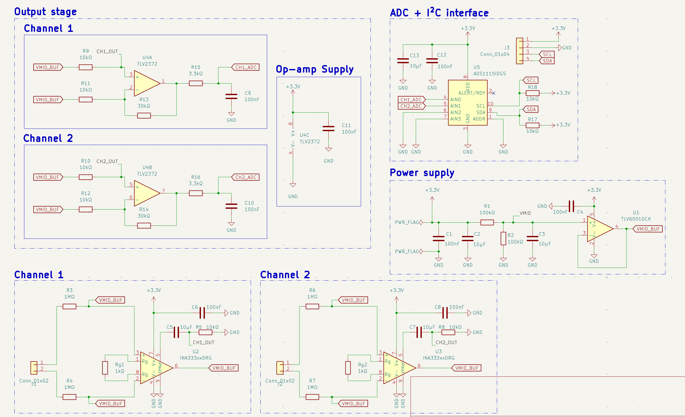
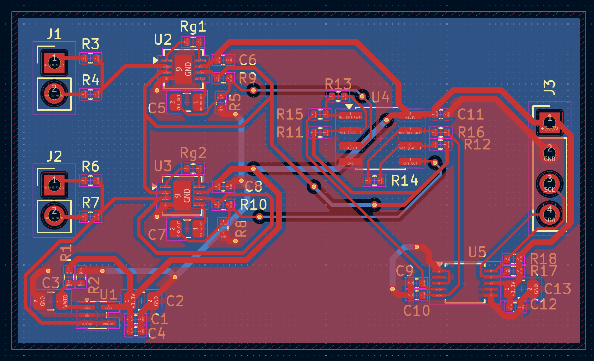
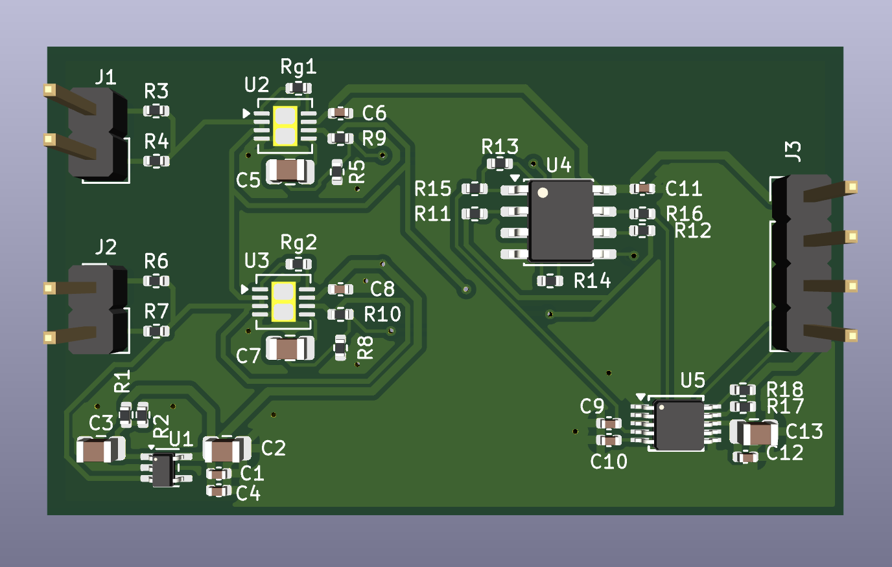

# EMG-Acquisition-Board

A dual-channel electromyography (EMG) signal acquisition board for surface
electrode input, designed as Project 1 of the Smart Prosthetic Arm system.
The board conditions raw muscle electrical signals into a clean, amplified,
digitised output suitable for real-time gesture classification firmware.

## Schematic

## PCB Layout

## 3D View

## Overview

Surface EMG signals are weak (50µV–5mV), heavily contaminated by DC electrode
offset, motion artefact, and 50Hz mains interference. This board addresses
each of these with a structured four-stage signal chain: differential
instrumentation amplification, AC coupling, a second gain stage, and
anti-alias filtering before a 16-bit I²C ADC. Total gain per channel is
approximately 404×, placing a 1mV EMG input at roughly 400mV at the ADC input
— well within the ADS1115's input range referenced to a 1.65V mid-rail.

## Design Notes

**Mid-rail bias generation:** The entire analog chain operates from a single
3.3V supply, which requires a stable 1.65V mid-rail reference to centre
signals within the supply range. A resistor divider (R1, R2 — 100kΩ each)
sets the VMID node at 1.65V, filtered by a 10µF capacitor (C3) to suppress
supply noise. A TLV6001DCK op-amp wired as a unity-gain voltage follower
buffers this reference (VMID_BUF), providing a low-impedance 1.65V rail that
drives the INA333 REF pins and the second-stage amplifier bias inputs. Without
the buffer, loading from the REF pins would pull VMID off its setpoint under
signal conditions.

**First-stage instrumentation amplifier:** Each channel uses an INA333 (SOIC-8)
configured for approximately 101× differential gain, set by a single 1kΩ gain
resistor (Rg) via the formula G = 1 + 100kΩ/Rg. The INA333 was selected for
its low offset voltage (25µV typical), low input bias current suitable for
high-impedance electrode sources, and single-supply rail-to-rail operation
down to 1.8V. The REF pin is tied to VMID_BUF on both channels, centering
the amplifier output at 1.65V. Input bias resistors (R3, R4 and R6, R7 —
1MΩ each) hold each differential input at VMID_BUF when no electrode is
connected, preventing the instrumentation amplifier inputs from floating and
the output from railing.

**AC coupling and high-pass filter:** The INA333 output passes through an RC
high-pass filter (C5/C7 — 10µF, R5/R8 — 10kΩ) with a cutoff frequency of
approximately 1.6Hz, calculated as f = 1/(2π × 10kΩ × 10µF). This removes
the residual DC electrode offset that survives the differential stage —
typically several hundred millivolts in practical electrode setups — while
passing all physiologically relevant EMG content above 20Hz with minimal
attenuation.

**Second-stage amplifier:** A TLV2372 dual op-amp (SOIC-8) provides 4×
additional gain per channel in a non-inverting topology, with the output
biased at VMID_BUF through the lower feedback resistor. Gain is set by the
ratio 1 + R13/R11 = 1 + 30kΩ/10kΩ = 4×. This stage also drives the
anti-alias filter, which a high-output-impedance source such as the RC filter
output could not do reliably.

**Anti-alias filter:** A first-order RC low-pass filter (R15/R16 — 3.3kΩ,
C9/C10 — 100nF) on each channel output sets the anti-alias cutoff at
approximately 480Hz, calculated as f = 1/(2π × 3.3kΩ × 100nF). This sits
just below the Nyquist frequency for a 1kHz ADC sampling rate, suppressing
out-of-band noise and aliasing artefacts before the signal reaches the ADC
input.

**ADC and I²C interface:** The ADS1115IDGS (MSOP-10) is a 16-bit successive-
approximation ADC with an internal programmable gain amplifier and I²C
interface. Channels AIN0 and AIN1 receive CH1_ADC and CH2_ADC respectively;
AIN2 and AIN3 are tied to GND. The ADDR pin is tied to GND, setting the I²C
address to 0x48. VDD is decoupled with a 100nF ceramic capacitor and a 10µF
bulk capacitor. I²C pull-up resistors (R17, R18 — 10kΩ each to +3.3V) are
placed immediately adjacent to J3, the 4-pin I²C header (VCC, GND, SCL, SDA),
which connects to the host microcontroller.

**Signal chain summary:**

| Stage | Component | Gain / Function |
|---|---|---|
| Instrumentation amp | INA333 × 2 | 101× differential |
| High-pass filter | RC (10µF, 10kΩ) | −3dB at 1.6Hz |
| Second stage | TLV2372 × 2 | 4× non-inverting |
| Anti-alias filter | RC (100nF, 3.3kΩ) | −3dB at 480Hz |
| ADC | ADS1115 | 16-bit, I²C, 0x48 |
| **Total gain** | | **~404×** |

## Manufacturing

- 2-layer stackup: F.Cu (signal + power) / B.Cu (GND plane)
- 1.6mm FR4, standard 1oz copper
- Passed DRC with 0 violations, 0 unconnected nets
- Gerbers and drill files generated

## Part of

Smart Prosthetic Arm — Project 1 of 6

## Tools

- KiCad