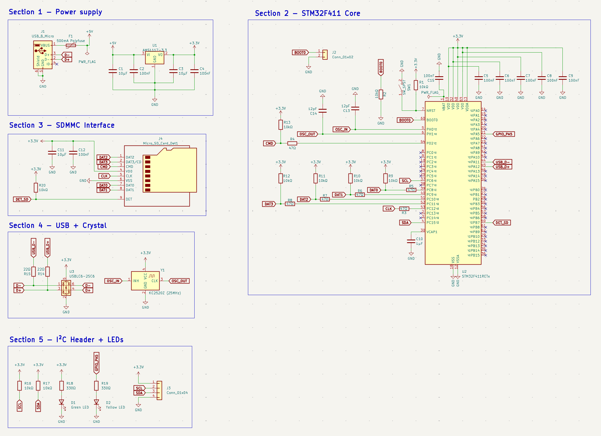
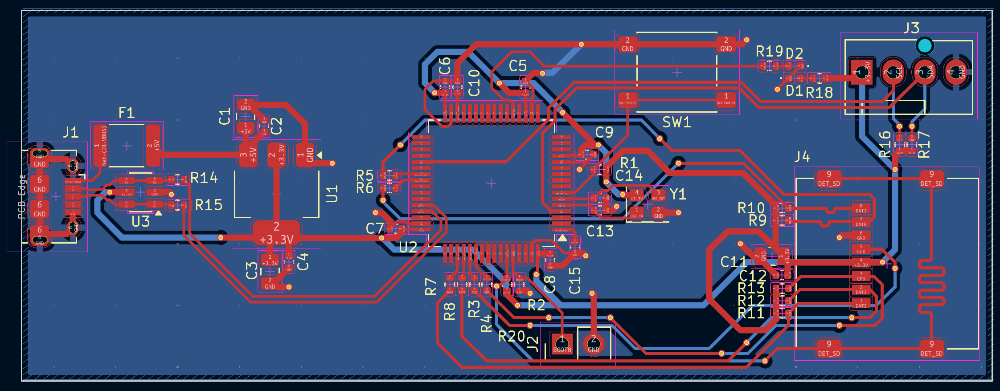
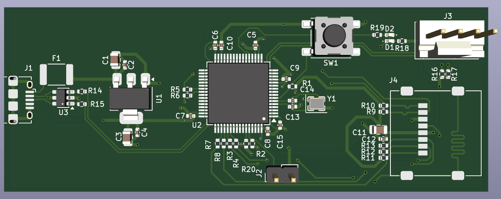

# STM32-SDMMC-Logger

An STM32F411-based data logger board with a 4-bit SDMMC interface to a
microSD card slot, designed as a companion to the EMG Acquisition Board.
The board receives dual-channel EMG data over I²C and logs it to a microSD
card in real time via FatFS, providing a self-contained data capture platform
for training the gesture classification firmware in the Smart Prosthetic Arm
system.

## Schematic

## PCB Layout

## 3D View

## Overview

The board pairs an STM32F411RETx (LQFP-64) with a push-push microSD card
slot over the SDMMC peripheral's 4-bit wide bus, capable of sustained write
speeds suitable for real-time dual-channel EMG logging at 1kHz sample rate.
A 25MHz crystal provides the accurate clock reference required for USB CDC
operation. Power comes from a micro-USB connector through a polyfuse and
AMS1117-3.3 LDO. A 4-pin I²C header matches the pinout of the EMG
Acquisition Board's J3 connector for direct cable connection.

## Design Notes

**MCU package selection:** The STM32F411 is available in UFQFPN-48 and
LQFP-64 packages. The UFQFPN-48 was initially considered but rejected because
the SDMMC peripheral requires PC8–PC12 and PD2, which are not bonded out on
the 48-pin package. The LQFP-64 exposes the full port C and port D, making
it the only viable option for 4-bit SDMMC operation on this device.

**SDMMC bus:** CLK, CMD, and DAT0–DAT3 connect the STM32's SDMMC peripheral
to the card slot using the standard STM32F4 pin mapping (PC12, PD2,
PC8–PC11). Each signal passes through a 47Ω series resistor placed close to
the STM32 to damp reflections at the card connector end. CMD and DAT0–DAT3
each have a 10kΩ pull-up to +3.3V — required by the SD specification to hold
these lines high during card initialisation before the card begins responding.
CLK has no pull-up since it is a push-pull output driven continuously by the
peripheral and is never in a high-impedance state.

**SDMMC signal integrity:** All six SDMMC signals are routed at 0.25mm width
on F.Cu with lengths kept as short as possible given the placement. The series
resistors are placed inline on each trace close to U2's pins. At the initial
operating frequency of 25MHz (half-speed mode, as used by FatFS during card
initialisation and typical logging workloads), the timing budget is generous
and the short trace lengths keep skew well within tolerance.

**Card detect:** The microSD connector includes a mechanical DET switch that
closes to GND when a card is inserted. This connects to PB7 with a 10kΩ
pull-up to +3.3V, keeping the GPIO high when no card is present and pulling
it low on insertion. The DAT3/CD pin on the card is used exclusively as DAT3
during normal 4-bit operation — the mechanical DET switch is used for card
presence detection to avoid conflicts with the data bus.

**Crystal and USB:** A 25MHz crystal (KC2520Z, 4-pad SMD) provides the
external clock reference for the STM32's PLL and USB peripheral. Load
capacitors C13 and C14 (12pF each) are placed immediately beside the PH0
and PH1 pins on U2, with no vias on the oscillator traces. The calculated
load capacitance is approximately 9pF, consistent with the crystal's
specification. USB D+ and D− are routed as a matched pair through the
USBLC6-2SC6 ESD protection device placed close to J1, then through 22Ω
series resistors before reaching PA11 and PA12.

**Power supply:** VBUS from J1 passes through a 500mA polyfuse (F1) before
reaching the AMS1117-3.3 LDO (U1). The polyfuse protects the USB host from
overcurrent faults and resets automatically once the fault clears. The LDO
input is decoupled with 10µF and 100nF capacitors; the output is decoupled
with 10µF and 100nF capacitors. All downstream logic and analog circuitry
runs from the 3.3V output.

**Stackup rationale:** This board uses a 2-layer stackup with signals and
power on F.Cu and a solid unbroken GND plane on B.Cu only — no GND pour on
F.Cu. For a digital board this configuration gives every F.Cu signal trace a
direct return path immediately beneath it, which is the optimal arrangement
for signal integrity. Adding a GND pour on F.Cu would fragment it with signal
traces, creating isolated copper islands that require stitching vias and
producing inconsistent return paths under SDMMC and USB signals. The solid
B.Cu plane handles all return currents cleanly without these compromises.
Stitching vias are placed around the board perimeter to tie the board edge
GND connections to the B.Cu plane.

**Decoupling:** The STM32F411RETx has four VDD pins and one VDDA pin, each
decoupled individually with a 100nF ceramic capacitor placed as close as
physically possible to the respective pin. The single VCAP1 pin is decoupled
with a 1µF capacitor as required by the internal core voltage regulator.
VBAT is decoupled with 100nF to GND.

## Manufacturing

- 2-layer stackup: F.Cu (signal + power) / B.Cu (solid GND plane)
- 1.6mm FR4, standard 1oz copper
- Passed DRC with 0 violations, 0 unconnected nets
- Gerbers and drill files generated

## Part of

Smart Prosthetic Arm — STM32-SDMMC-Logger #2

## Tools

- KiCad
