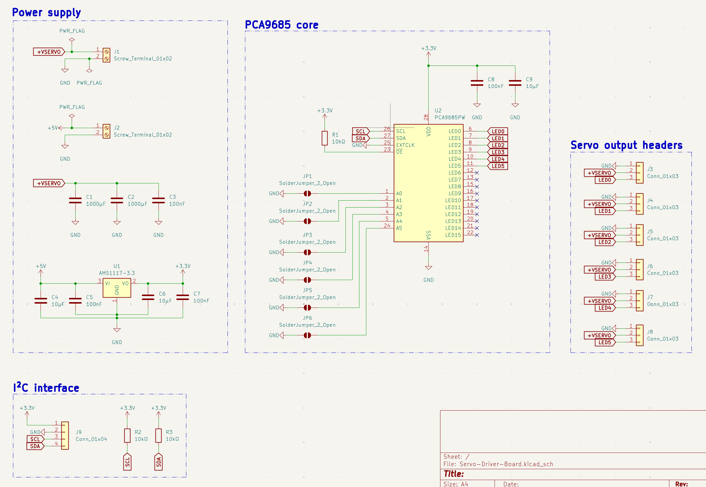
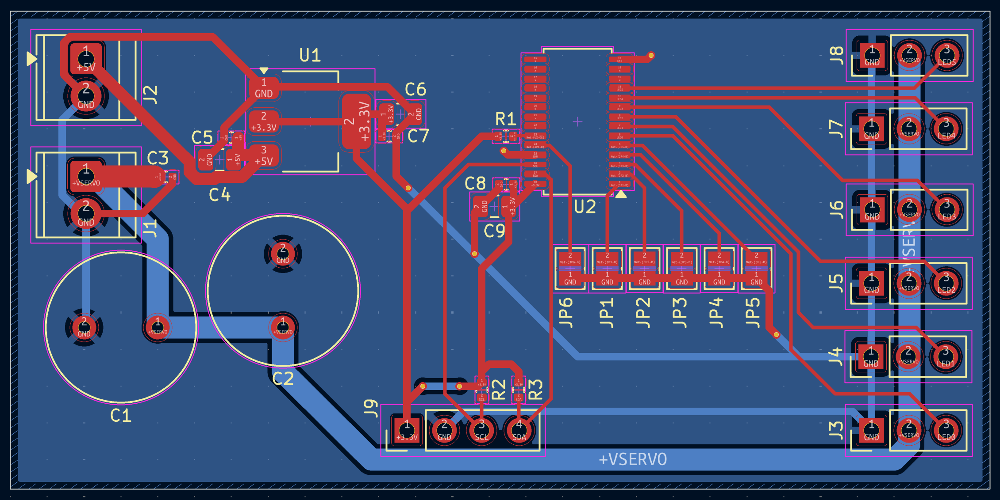
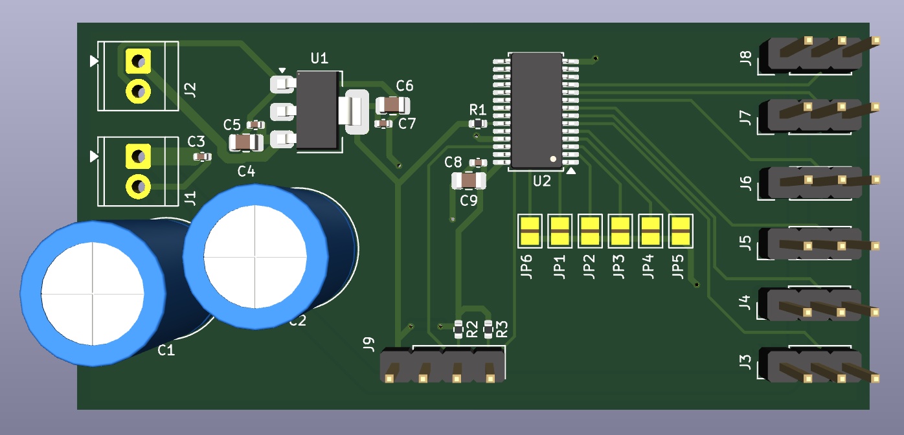

# Servo-Driver-Board

A PCA9685-based 16-channel PWM servo controller board designed as Project 3
of the Smart Prosthetic Arm system. The board receives motion commands over
I²C from a host microcontroller and drives up to 6 servo motors — one per
finger and one for wrist rotation — providing the full actuation layer of the
prosthetic hand.

## Schematic

## PCB Layout

## 3D View

## Overview

The board separates the servo power rail (+VSERVO, 5–6V, high current) from
the logic rail (+3.3V, low current) to prevent servo switching transients
from disturbing the PCA9685 and I²C bus. A host microcontroller — such as
the STM32 on the SDMMC Logger board — sends PWM duty cycle commands over I²C,
and the PCA9685 generates the corresponding 50Hz servo control signals on its
output channels. The I²C header pinout matches the EMG Acquisition Board and
SDMMC Logger for direct cable connection across the system.

## Why PCA9685 Instead of an STM32

Generating 6 independent 50Hz PWM signals in firmware consumes 6 hardware
timer channels on a host MCU, leaving fewer resources for sensor reading,
gesture classification, and data logging running concurrently. The PCA9685
offloads all PWM generation to dedicated hardware over a single I²C
connection, freeing the host MCU entirely. It also allows the servo driver
to be replaced or reconfigured independently of the host firmware, and
supports up to 64 boards on one I²C bus via address pin configuration —
making the architecture extensible to more complex prosthetic hand designs
with more degrees of freedom.

## Design Notes

**Dual power rail architecture:** Two separate screw terminals feed the board.
J1 supplies +VSERVO (5–6V, rated for peak servo current) directly to the
servo headers and bulk capacitors. J2 supplies +5V to the AMS1117-3.3 LDO
which generates the 3.3V logic rail for the PCA9685. The rails are
intentionally separate — servo motors produce large current transients during
acceleration and stall, and coupling these onto the logic rail would cause
I²C communication errors and PWM glitches.

**Bulk capacitance on servo rail:** Two 1000µF electrolytic capacitors (C1,
C2) are placed immediately adjacent to J1 on the +VSERVO rail. These absorb
the inrush current when multiple servos move simultaneously and prevent the
supply voltage from drooping during peak load. Without them, a sudden
multi-servo movement would cause a voltage dip that could brown out the logic
rail through ground bounce. A 100nF ceramic capacitor (C3) provides
high-frequency decoupling in parallel.

**VSERVO trace width:** The +VSERVO rail and its GND return are routed at
1.5mm throughout the board. With 6 servos drawing up to 1A each at stall,
the rail must handle up to 6A peak. A 1.5mm trace on 1oz copper carries
approximately 2.5A with a 10°C temperature rise — the parallel GND return
path and copper pour keep the effective current capacity well above the
peak demand.

**PWM output channels:** The PCA9685 exposes 16 PWM channels (LED0–LED15).
This board uses LED0–LED5 for the six servo outputs, connected through
0.25mm signal traces to J3–J8. LED6–LED15 are left unconnected with
no-connect flags, available for future expansion to additional servo axes.

**Address selection:** Six solder jumpers (JP1–JP6) connect address pins
A0–A5 to GND. All jumpers are open by default — the PCA9685's internal
pull-downs hold the address pins low, setting the I²C address to 0x40.
Bridging any jumper hard-connects that address pin to GND, which is
electrically identical but noise-immune. If a second servo driver board
is added to the same I²C bus, bridge one jumper to assign address 0x41,
avoiding a bus conflict without any firmware changes to the first board.

**OE pin:** The active-low Output Enable pin (OE) is pulled high to +3.3V
through R1 (10kΩ), keeping all PWM outputs active by default. Pulling OE
low externally disables all outputs simultaneously — useful for a hardware
emergency stop without an I²C transaction.

**EXTCLK pin:** Tied to GND, disabling the external clock input and selecting
the PCA9685's internal 25MHz oscillator. No external crystal is required.

**Stackup rationale:** Signals and power are routed on F.Cu. B.Cu carries a
solid unbroken GND pour covering the entire board — no GND pour on F.Cu.
This gives every F.Cu trace a direct return path immediately beneath it,
which is the optimal configuration for a 2-layer board. A fragmented F.Cu
pour would create isolated copper islands requiring stitching vias and
inconsistent return paths under the PWM signal traces. Stitching vias connect
the board edge GND connections to the B.Cu plane.

## Servo Connector Pinout

Each of J3–J8 follows the standard servo connector pinout:

| Pin | Signal |
|---|---|
| 1 | GND |
| 2 | +VSERVO (5–6V) |
| 3 | PWM signal |

## I²C Interface

| J9 Pin | Signal |
|---|---|
| 1 | +3.3V |
| 2 | GND |
| 3 | SCL |
| 4 | SDA |

Default I²C address: **0x40** (all address jumpers open)

## Manufacturing

- 2-layer stackup: F.Cu (signal + power) / B.Cu (solid GND plane)
- 1.6mm FR4, standard 1oz copper
- Passed DRC with 0 violations, 0 unconnected nets
- Gerbers and drill files generated

## Part of

Smart Prosthetic Arm — Servo-Driver #3

## Tools

- KiCad
