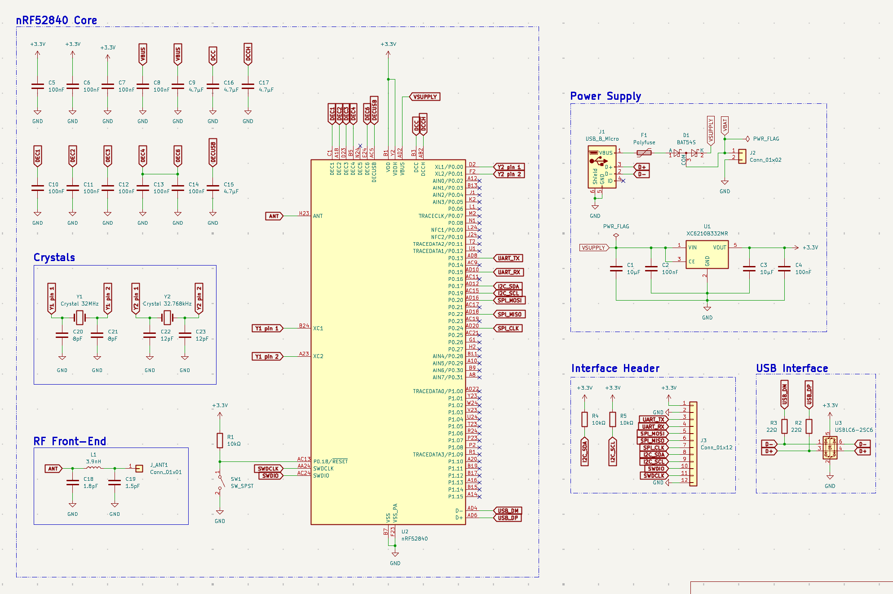
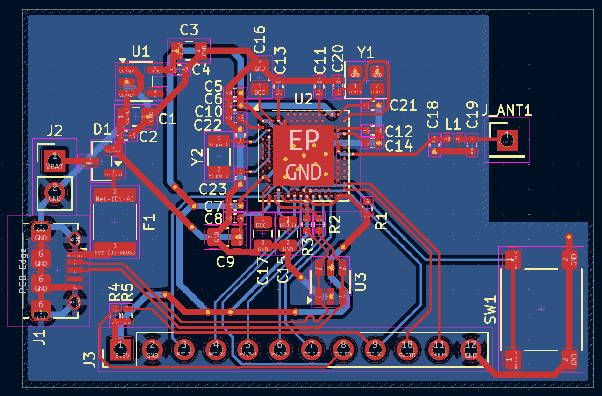
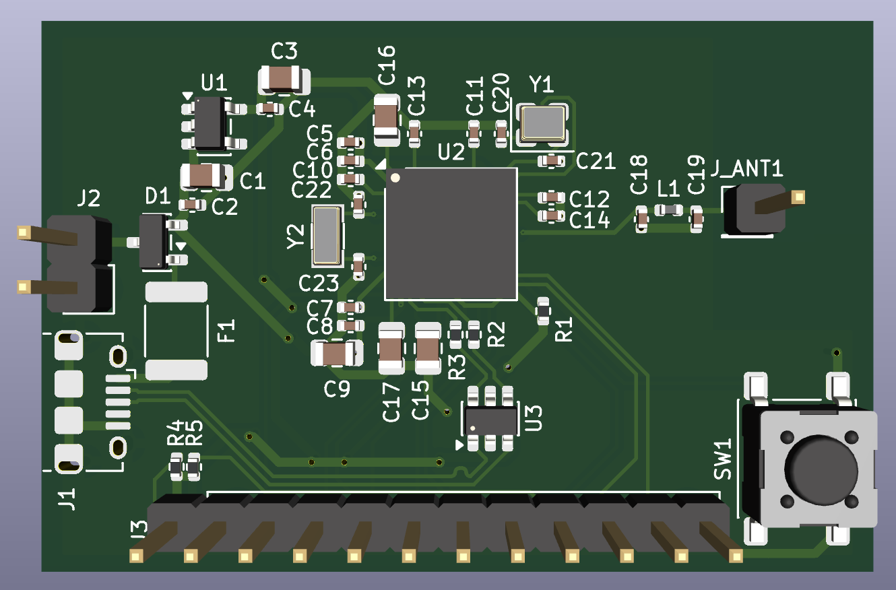

# BLE-Module-Board

A Nordic nRF52840-based Bluetooth Low Energy 5.0 telemetry module designed
as Project 4 of the Smart Prosthetic Arm system. The board receives gesture
commands and EMG telemetry from the prosthetic arm system and transmits them
wirelessly to a smartphone or PC for real-time monitoring, configuration, and
data logging. It also serves as a wireless command receiver, enabling remote
arm configuration without a physical connection.

## Schematic

## PCB Layout

## 3D View

## Overview

The nRF52840 integrates a 2.4GHz BLE 5.0 radio, an ARM Cortex-M4F processor,
USB device controller, and extensive GPIO peripherals in a single aQFN-73
package. This board exposes the full interface set — UART, SPI, I²C, SWD, and
power — through a single 12-pin header, matching the pinout conventions of the
EMG Acquisition Board and SDMMC Logger for direct cable connection across the
system. A dual-input power circuit accepts either USB (5V) or a 3.7V LiPo
battery, making the board suitable for both bench development and wearable
deployment on the prosthetic arm.

## Design Notes

**Bare IC vs pre-certified module:** The nRF52840-QIAA bare IC was chosen
over a pre-certified module such as the Holyiot or u-blox NINA-B3. A module
integrates the antenna and passes regulatory certification as a unit, which
simplifies deployment but reduces design transparency and portfolio value.
Using the bare IC requires designing the RF front-end and antenna matching
network explicitly, producing a more technically rigorous board and a stronger
demonstration of RF PCB design capability.

**Power architecture — dual input OR-ing:** The board accepts power from two
sources simultaneously without conflict. USB VBUS and LiPo VBAT each feed
one anode of a BAT54S dual Schottky diode in common-cathode configuration.
The higher voltage source conducts through its diode and feeds the VSUPPLY
net; the lower voltage source is blocked automatically. VSUPPLY feeds both
the XC6210B332MR LDO (generating 3.3V for all logic) and the nRF52840's
VBUS pin (enabling the internal USB 3.3V regulator when USB is connected).
When running from LiPo only, VSUPPLY is approximately 3.4V after the diode
drop — the LDO dropout of 75mV at this level still produces a stable 3.3V
output, and the USB regulator is simply inactive. This means BLE operation
continues from battery without interruption while USB programming requires
USB connection.

**LDO selection:** The XC6210B332MR was chosen over the AMS1117-3.3 used
on previous boards specifically for its 75mV dropout voltage versus the
AMS1117's 1.3V dropout. The AMS1117 would require a minimum 4.6V input to
regulate to 3.3V — far above a LiPo battery's end-of-discharge voltage of
3.0V. The XC6210 operates reliably from VSUPPLY down to approximately 3.375V,
covering the full usable LiPo range. The CE pin is tied permanently high to
keep the regulator enabled at all times.

**RF front-end and antenna matching:** The nRF52840 ANT pin connects to a
pi-network matching circuit before the antenna connection point J_ANT. The
network consists of a 1.8pF shunt capacitor to GND on the IC side, a 3.9nH
series inductor, and a 1.5pF shunt capacitor to GND on the antenna side.
These values are taken directly from the Nordic reference schematic for a
quarter-wave wire antenna at 2.4GHz, targeting 50Ω impedance at the antenna
feed point. The entire pi-network is placed in a straight horizontal line
between the ANT pin and J_ANT, within 10mm total path length, with GND vias
immediately beside each shunt capacitor pad to minimise return-path
inductance at 2.4GHz.

**Antenna keepout zone:** A rule area covering the top-right corner of the
board prohibits copper fills on both F.Cu and B.Cu within 5mm of J_ANT and
the wire antenna. The B.Cu GND plane stops at the keepout boundary. Copper
beneath or adjacent to the antenna would detune it by acting as a parasitic
reflector, shifting the resonant frequency away from 2.4GHz and reducing
radiated efficiency. The quarter-wave wire antenna (31.25mm, λ/4 at 2.4GHz)
connects to J_ANT and extends outside the keepout zone.

**Crystal oscillators:** The nRF52840 requires two external crystals. Y1
(32MHz, 2520 SMD package, 8pF load capacitance) provides the main RF and
CPU clock reference — placed within 3mm of XC1/XC2 with no vias on the
oscillator traces. Y2 (32.768kHz, 3215 SMD package, 12.5pF load capacitance)
provides the RTC clock for low-power sleep scheduling — placed beside XL1/XL2
with vias acceptable given the low operating frequency. Load capacitors for
both crystals are placed inline between the MCU pin and the crystal pad on
the MCU side.

**DEC4 and DEC6 connection:** The Nordic datasheet requires DEC4 and DEC6
to be directly connected to each other in addition to having individual 100nF
decoupling capacitors to GND. These pins are the 1.3V internal regulator
supply decoupling nodes — the direct connection between them is mandatory per
the datasheet and is implemented with a short trace between the two pads.

**USB ESD protection:** The USBLC6-2SC6 is placed immediately adjacent to J1,
providing transient voltage suppression on both D+ and D− before the 22Ω
series resistors that connect to the nRF52840's USB pins. ESD protection must
be at the connector — placing it midway along the trace reduces its
effectiveness.

**SWD debug interface:** SWDIO and SWDCLK are exposed on pins 10 and 11 of
the 12-pin interface header J3, alongside UART, SPI, I²C, power, and GND.
A single connector handles both runtime communication and firmware programming,
eliminating the need for a separate debug header.

**Stackup rationale:** F.Cu carries all signal and power traces with no copper
pour. B.Cu carries a solid unbroken GND plane across the entire board except
the antenna keepout zone. This gives every signal trace a direct return path
immediately beneath it — the optimal configuration for a 2-layer RF board.
Stitching vias connect the board edge GND connections to the B.Cu plane every
5mm around the perimeter. A minimum of 4 vias are placed through the nRF52840
exposed die pad to the B.Cu GND plane as required for both electrical and
thermal connection.

## Interface Header Pinout (J3)

| Pin | Signal |
|---|---|
| 1 | +3.3V |
| 2 | GND |
| 3 | UART_TX |
| 4 | UART_RX |
| 5 | SPI_MOSI |
| 6 | SPI_MISO |
| 7 | SPI_CLK |
| 8 | I2C_SDA |
| 9 | I2C_SCL |
| 10 | SWDIO |
| 11 | SWDCLK |
| 12 | GND |

## Manufacturing

- 2-layer stackup: F.Cu (signal + power) / B.Cu (solid GND plane)
- 1.6mm FR4, standard 1oz copper
- Antenna keepout zone: no copper on either layer within 5mm of J_ANT
- Passed DRC with 0 violations, 0 unconnected nets
- Gerbers and drill files generated

## Part of

Smart Prosthetic Arm — Project 4 of 6

## Tools

- KiCad