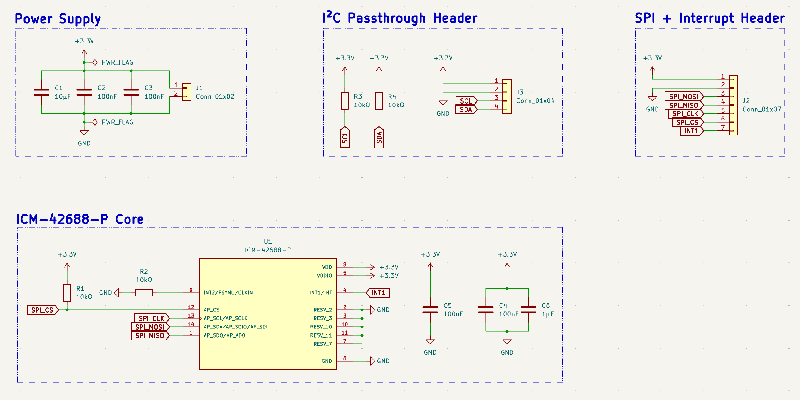
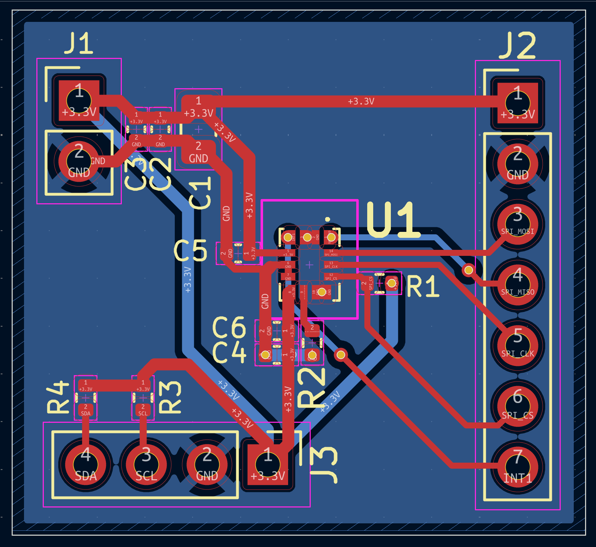
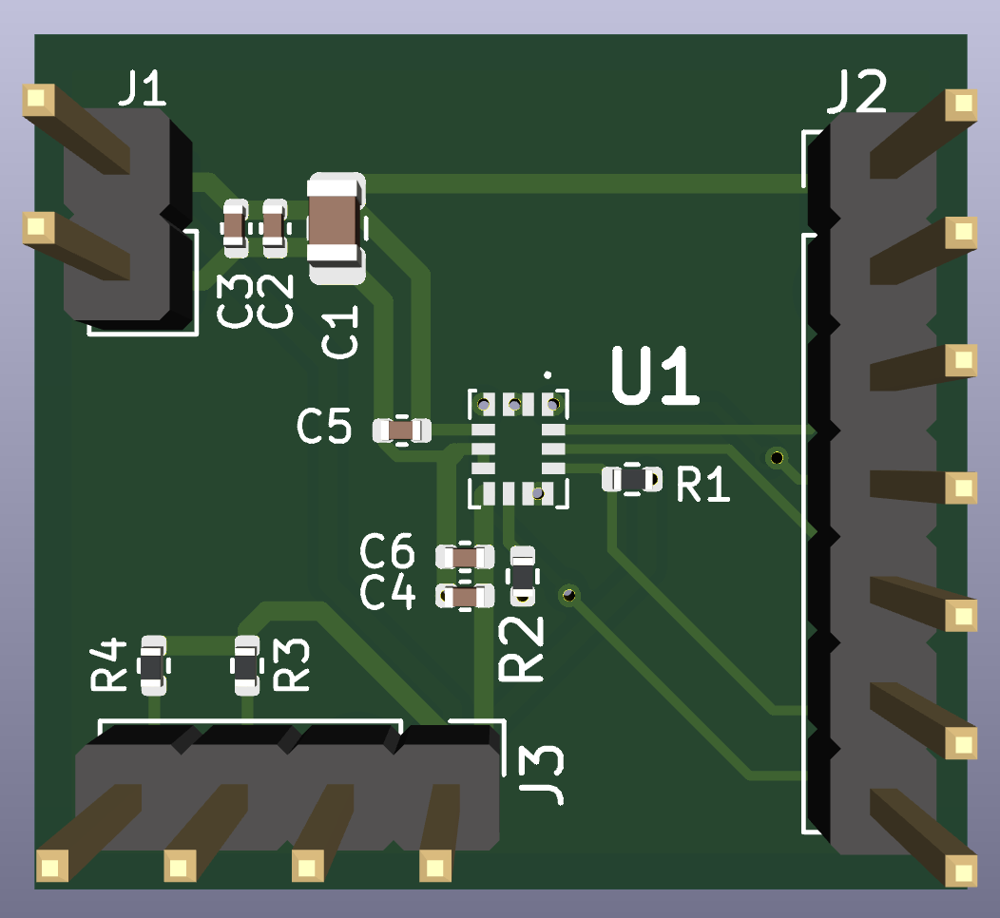

# IMU-Sensor-Fusion-Board

A TDK InvenSense ICM-42688-P based 6-axis IMU board designed as Project 5
of the Smart Prosthetic Arm system. The board adds wrist orientation and
motion context to the dual-channel EMG signals from the EMG Acquisition
Board, enabling the gesture classifier firmware to distinguish between
gestures that produce similar EMG patterns but differ in wrist orientation —
significantly improving real-world classification accuracy.

## Schematic

## PCB Layout

## 3D View

## Overview

The ICM-42688-P integrates a 3-axis gyroscope and 3-axis accelerometer in a
compact 2.5×3.0mm LGA-14 package, providing full 6-axis motion data over a
high-speed SPI interface at up to 24MHz. The board exposes the SPI bus,
chip select, and both interrupt lines through a 7-pin header for direct
connection to the host microcontroller, and passes through the I²C bus on a
4-pin header matching the EMG Acquisition Board pinout — allowing the host
to communicate with the ADS1115 ADC and the IMU simultaneously without
additional wiring.

## Design Notes

**IMU selection:** The ICM-42688-P was selected over lower-tier IMUs such as
the MPU6050 for several reasons directly relevant to prosthetic arm use. Its
gyroscope noise density of 2.8 mdps/√Hz and accelerometer noise density of
65 µg/√Hz are among the lowest available in a single-package 6-axis device,
enabling detection of subtle wrist rotation and fine finger-positioning
gestures that would be buried in noise on a less capable sensor. The device
also supports output data rates up to 32kHz, providing substantial
oversampling headroom for the sensor fusion algorithm. The 1.71–3.6V supply
range is directly compatible with the 3.3V system rail without a dedicated
LDO.

**SPI interface:** The ICM-42688-P is operated in 4-wire SPI mode. AP_CS
(pin 12) is the chip select, held high by R1 (10kΩ pull-up to +3.3V) when
the bus is idle. AP_SCL/AP_SCLK (pin 13) is the clock, AP_SDA/AP_SDI
(pin 14) is MOSI, and AP_SDO/AP_AD0 (pin 1) is MISO. In SPI mode the
AP_AD0 function of pin 1 is overridden by the chip select state at power-up
— AP_CS tied high ensures SPI mode is selected correctly.

**Reserved pin handling:** The ICM-42688-P datasheet specifies explicit
requirements for each reserved pin. RESV_7 (pin 7) must be connected to GND
— this is mandatory and not optional. RESV_2 (pin 2) and RESV_3 (pin 3) may
be left unconnected or tied to GND — both are tied to GND on this board for
noise immunity. RESV_10 (pin 10) and RESV_11 (pin 11) may be left
unconnected — no-connect flags are placed on both.

**FSYNC/CLKIN pin (pin 9):** The INT2/FSYNC/CLKIN pin serves three functions
depending on firmware configuration. Since frame sync and external clock are
not used in this design, the pin is held low through a 10kΩ pull-down
resistor (R2) to GND. A direct GND connection was avoided because the
SnapEDA symbol defines pin 9 as bidirectional — connecting it directly to a
power symbol generates a KiCad ERC pin-type conflict. The pull-down resistor
resolves the conflict while satisfying the datasheet requirement to hold the
pin low when unused.

**Interrupt lines:** INT1 (pin 4) is broken out to pin 7 of the SPI header
as the primary data-ready interrupt — the host firmware configures INT1 to
assert when new accelerometer and gyroscope data is available in the output
registers, enabling interrupt-driven sampling without polling. INT2 is not
connected on this board — it is available for future use via firmware
reconfiguration if a second interrupt source is needed.

**Power supply and decoupling:** The board accepts 3.3V directly with no
onboard LDO. Three decoupling capacitors are placed at the power input: C1
(10µF bulk), C2 (100nF ceramic), C3 (100nF ceramic). At the ICM-42688-P
VDD pin (pin 8): C5 (100nF) and C6 (1µF) are placed as close as physically
possible to the pin. At VDDIO (pin 5): C4 (100nF) is placed immediately
adjacent. Keeping VDD and VDDIO decoupling separate and local is important
for a MEMS sensor — shared decoupling allows switching noise on the digital
IO rail to couple into the analog sensor supply, increasing noise floor on
both accelerometer and gyroscope outputs.

**I²C passthrough:** J3 is a 4-pin header (+3.3V, GND, SCL, SDA) with
pinout identical to the EMG Acquisition Board's J3 and the SDMMC Logger's
J4. Pull-up resistors R3 and R4 (10kΩ each to +3.3V) are placed immediately
beside J3. This header allows the host to reach the ADS1115 on the EMG board
over the same I²C bus without an additional cable run, keeping the wiring
harness on the prosthetic arm minimal.

**Stackup rationale:** F.Cu carries all signal and power traces with no
copper pour. B.Cu carries a solid unbroken GND plane across the entire board.
This gives every signal trace a direct return path immediately beneath it —
particularly important for the SPI clock and data lines where a fragmented
return path would increase crosstalk between channels. Stitching vias connect
the board edge GND connections to the B.Cu plane around the perimeter.

## Interface Headers

**J2 — SPI + Interrupt (Conn_01x07):**

| Pin | Signal |
|---|---|
| 1 | +3.3V |
| 2 | GND |
| 3 | SPI_MOSI |
| 4 | SPI_MISO |
| 5 | SPI_CLK |
| 6 | SPI_CS |
| 7 | INT1 |

**J3 — I²C Passthrough (Conn_01x04):**

| Pin | Signal |
|---|---|
| 1 | +3.3V |
| 2 | GND |
| 3 | SCL |
| 4 | SDA |

## Manufacturing

- 2-layer stackup: F.Cu (signal + power) / B.Cu (solid GND plane)
- 1.6mm FR4, standard 1oz copper
- Passed DRC with 0 violations, 0 unconnected nets
- Gerbers and drill files generated

## Part of

Smart Prosthetic Arm — Project 5 of 6

## Tools

- KiCad
