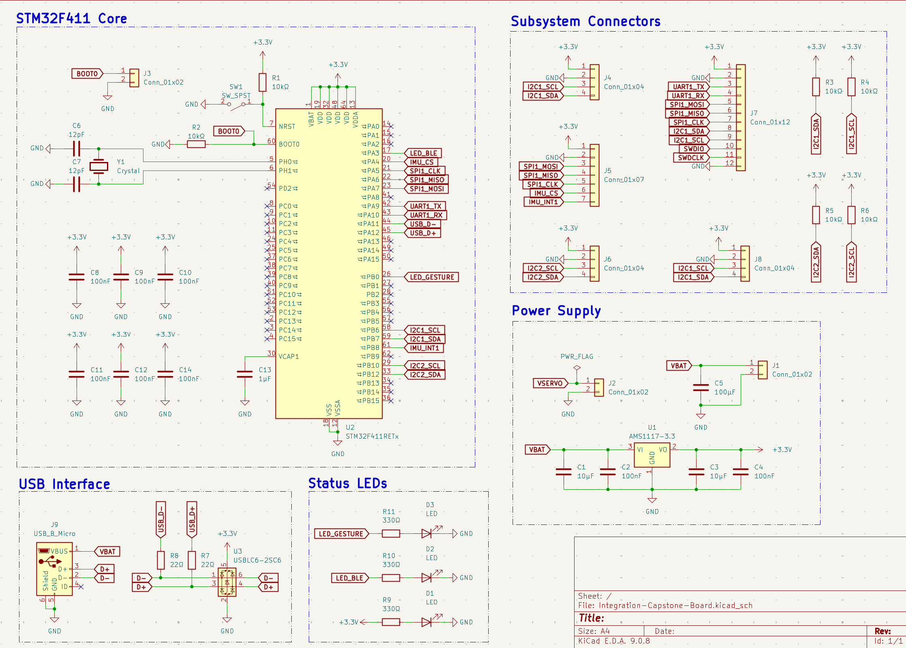
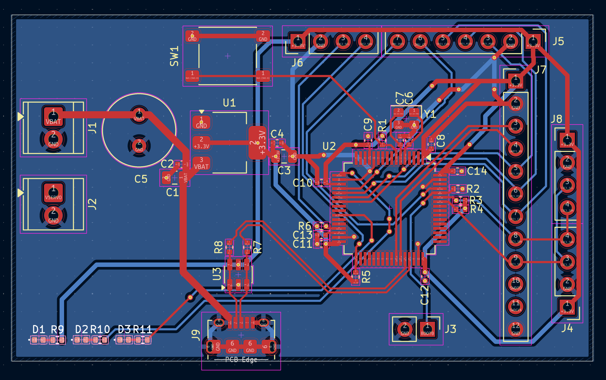
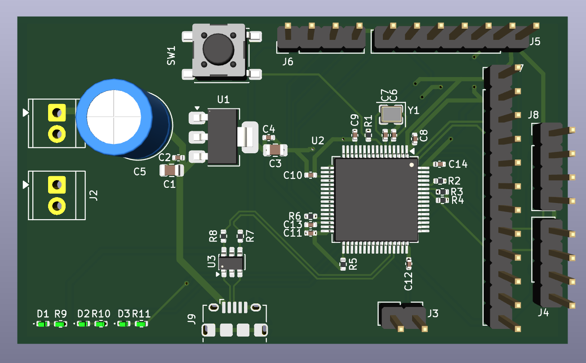

# Integration-Capstone-Board

The central hub of the Smart Prosthetic Arm system, designed as Project 6
of 6. This board hosts the main STM32F411RETx microcontroller and provides
the physical connectors, power distribution, and signal routing that ties
all five subsystem boards into a unified wearable system — the EMG
Acquisition Board, Servo Driver Board, BLE Module, IMU Sensor Fusion Board,
and the Gesture Classifier firmware running on the STM32 itself.

## Schematic

## PCB Layout

## 3D View

## Overview

Rather than designing another standalone sensor or actuator board, the
capstone solves the real system integration challenge — making five
independent boards work together reliably as a wearable prosthetic arm.
The STM32F411 reads dual-channel EMG data from the ADS1115 over I²C,
reads 6-axis IMU data from the ICM-42688-P over SPI, classifies the
fused sensor data into one of six hand gestures, sends servo position
commands to the PCA9685 over I²C, and streams telemetry to the nRF52840
BLE module over UART — all concurrently, from a single board running on
a 3.7V LiPo battery.

## System Connections

| Connector | Subsystem | Interface | Pinout match |
|---|---|---|---|
| J4 | EMG Acquisition Board | I²C1 | Matches EMG board J3 |
| J5 | IMU Sensor Fusion Board | SPI1 + INT1 | Matches IMU board J2 |
| J6 | IMU I²C Passthrough | I²C2 | Matches IMU board J3 |
| J7 | BLE Module | UART1 + SPI1 + I²C1 + SWD | Matches BLE board J3 |
| J8 | Servo Driver Board | I²C1 | Matches servo driver J9 |
| J9 | USB | Programming + CDC | Micro-B |

All connector pinouts were designed from the start of the project to match
across boards — plugging any subsystem board into its corresponding header
requires no adapter and no rewiring.

## Design Notes

**Dual I²C bus architecture:** The STM32F411 has two I²C peripherals. I²C1
(PB6/PB7) is the main system bus, shared between the EMG Acquisition Board
(ADS1115, address 0x48), the Servo Driver Board (PCA9685, address 0x40),
and the BLE module's I²C lines. I²C2 (PB10/PB11) is a dedicated bus for
the IMU board's I²C passthrough header — isolating the IMU's local I²C
traffic from the main system bus prevents address conflicts and reduces bus
loading. Separate 10kΩ pull-up pairs (R3/R4 for I²C1, R5/R6 for I²C2)
are placed immediately beside their respective connectors.

**SPI bus sharing:** SPI1 (PA5/PA6/PA7) is shared between the IMU Sensor
Fusion Board (J5) and the BLE module (J7). The IMU chip select (IMU_CS on
PA4) and the BLE module's SPI CS are managed independently by the firmware,
allowing both devices on the same SPI bus without conflict. SPI was chosen
for the IMU over I²C to allow data rates up to 24MHz — necessary for high
ODR IMU sampling concurrent with BLE activity.

**Power architecture:** A single LiPo cell (3.7V nominal) connects to J1.
The AMS1117-3.3 LDO (U1) regulates this to 3.3V for the STM32, crystal,
and all subsystem connector power pins. A 100µF bulk electrolytic capacitor
(C5) is placed immediately at J1 to handle inrush current during system
startup when all five subsystem boards power up simultaneously. J2 is a
separate screw terminal for the 6V servo power rail — this passes directly
to the Servo Driver Board via cable and is never routed across the
integration board's PCB, keeping high-current servo switching noise isolated
from the logic rail.

**Crystal and USB:** A 25MHz crystal (Y1) provides the STM32's PLL
reference for accurate USB CDC operation. Load capacitors C6 and C7 (12pF
each) are placed immediately beside PH0 and PH1 with no vias on the
oscillator traces. USB D+ and D− pass through the USBLC6-2SC6 ESD
protection device (U3) placed immediately adjacent to J9, then through 22Ω
series resistors before reaching PA11 and PA12. The USB VBUS pin connects
to the VBAT net — when USB is connected it powers the board directly,
supplementing or replacing the LiPo without additional power management
circuitry.

**Reset and boot:** SW1 is a tactile push button connected to NRST with a
10kΩ pull-up to +3.3V, placed close to U2's NRST pin to minimise the reset
trace length. R2 pulls BOOT0 low by default for normal flash execution mode.
J3 is a 2-pin BOOT0 header that allows the STM32 to be put into DFU mode
by bridging pin 1 to +3.3V — used for initial firmware flashing before the
USB CDC interface is operational.

**Status LEDs:** Three LEDs provide system state visibility. D1 (green,
always on) connects directly from +3.3V through R9 — it illuminates
whenever the board is powered, requiring no firmware. D2 (blue) is driven
by PA3 through R10 and is toggled by firmware to indicate an active BLE
connection. D3 (yellow) is driven by PB0 through R11 and pulses on each
recognised gesture event. All three resistors are 330Ω giving approximately
8mA LED current at 3.3V supply — visible in indoor and outdoor conditions
without excessive current draw from the battery.

**Stackup rationale:** F.Cu carries all signal and power traces with no
copper pour. B.Cu carries a solid unbroken GND plane across the entire
board. This gives every signal trace — including the dense I²C, SPI, and
UART routing between U2 and the subsystem connectors — a direct return path
immediately beneath it, minimising crosstalk between the parallel bus
signals. A minimum of 4 vias are placed through the STM32's exposed GND pad
to the B.Cu plane for both electrical and thermal connection. Stitching vias
connect the board edge GND connections to the B.Cu plane around the
perimeter.

## GPIO Map

| GPIO | Function | Destination |
|---|---|---|
| PA3 | LED_BLE | D2 blue LED |
| PA4 | IMU_CS | J5 pin 6 |
| PA5 | SPI1_CLK | J5 pin 5, J7 pin 7 |
| PA6 | SPI1_MISO | J5 pin 4, J7 pin 6 |
| PA7 | SPI1_MOSI | J5 pin 3, J7 pin 5 |
| PA9 | UART1_TX | J7 pin 3 |
| PA10 | UART1_RX | J7 pin 4 |
| PA11 | USB_DM | J9 D− |
| PA12 | USB_DP | J9 D+ |
| PB0 | LED_GESTURE | D3 yellow LED |
| PB6 | I2C1_SCL | J4 pin 3, J7 pin 9, J8 pin 3 |
| PB7 | I2C1_SDA | J4 pin 4, J7 pin 8, J8 pin 4 |
| PB8 | IMU_INT1 | J5 pin 7 |
| PB10 | I2C2_SCL | J6 pin 3 |
| PB11 | I2C2_SDA | J6 pin 4 |
| PH0 | OSC_IN | Y1 pin 1 |
| PH1 | OSC_OUT | Y1 pin 2 |

## Manufacturing

- 2-layer stackup: F.Cu (signal + power) / B.Cu (solid GND plane)
- 1.6mm FR4, standard 1oz copper
- Passed DRC with 0 violations, 0 unconnected nets
- Gerbers and drill files generated

## Part of

Smart Prosthetic Arm — Project 6 of 6

## Tools

- KiCad